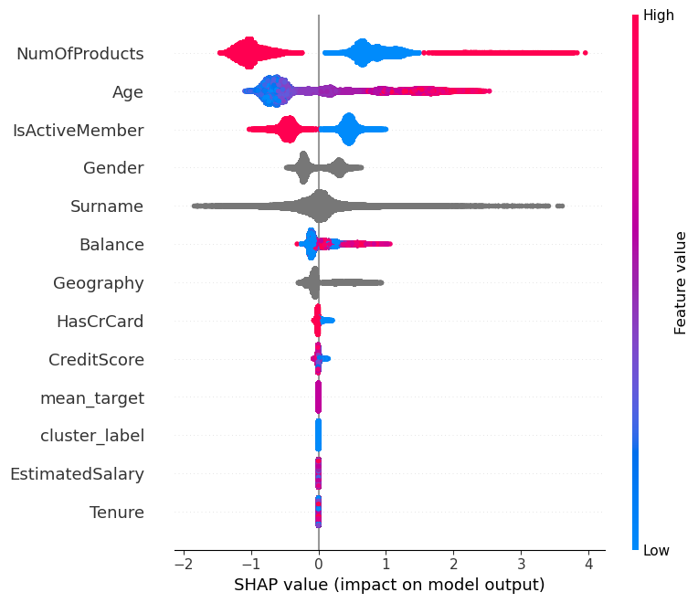
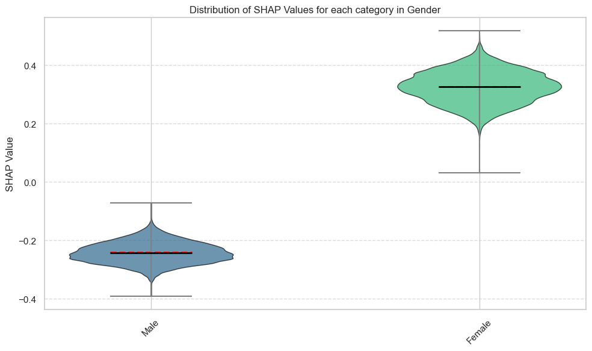
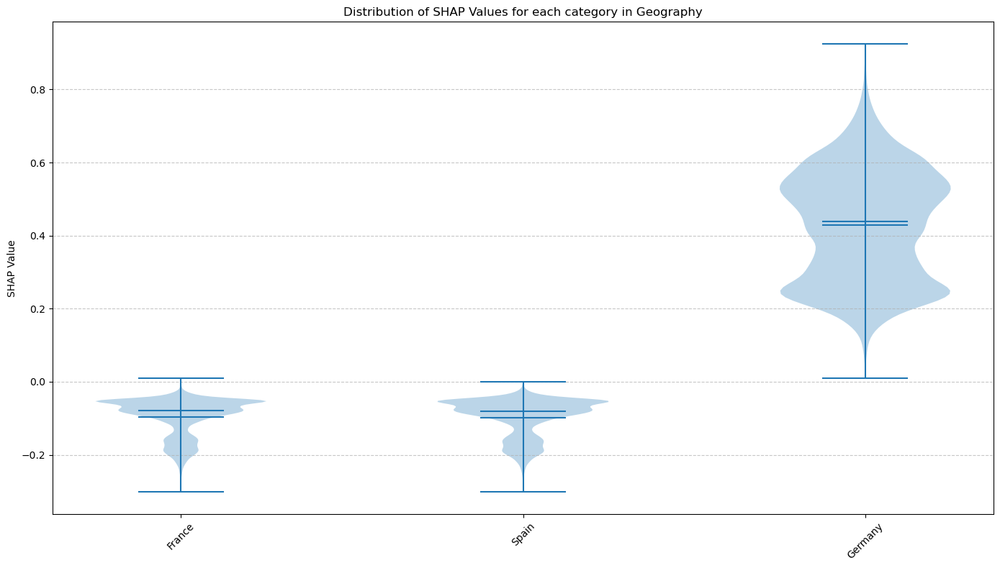

## Executive Summary: Binary Classification for Bank Churn Prediction

This project addresses the common business problem of customer churn prediction within a banking context. The primary objective was to develop a robust binary classification model to identify customers likely to "Exit" and identify key drivers of churn, enabling proactive retention strategies.

**Methodology & Key Achievements:**

1.  **Data Foundation:** The analysis utilized provided `train.csv` and `test.csv` datasets. The target variable was clearly identified as 'Exited'.
2.  **Structured Workflow & Custom Utilities:** A modular approach was adopted, leveraging custom utility functions for various MLOps tasks including data cleaning, preprocessing, feature engineering, modeling, and model explanation. This demonstrates good software engineering practices within a data science context.
3.  **Feature Engineering:** A significant aspect of this project was strategic feature engineering. Notably:
    *   **Clustering-based Target Encoding:** Unsupervised clustering was applied to the combined dataset to create `cluster_label`.
    *   A powerful `mean_target` feature was then engineered by calculating the average churn rate within these clusters. Crucially, this was derived *exclusively from training data information* to prevent target leakage, a common pitfall.
4.  **Preprocessing:** Categorical features (e.g., 'Surname', 'Geography', 'Gender') were identified and appropriately converted to a 'category' data type, optimizing them for the LightGBM model.
5.  **Modeling & Performance:**
    *   A LightGBM (Light Gradient Boosting Machine) classifier was chosen for its efficiency and high performance on tabular data.
    *   The model was trained with specific hyperparameters (e.g., `n_estimators=1000`, `learning_rate=0.1`) and employed an early stopping mechanism based on a 10% validation split, optimizing for the AUROC metric.
    *   The model achieved a strong validation AUROC of approximately **0.8903**.
    *   This translated to a competitive Kaggle private leaderboard score of **0.88863** and a public score of **0.88436**, indicating good generalization to unseen data.
6.  **Model Explainability:**
    *   SHAP (SHapley Additive exPlanations) values were utilized to interpret the model's predictions and identify key drivers of churn.
    *   The analysis revealed that the engineered `mean_target` feature and customer `Age` were among the most influential predictors.
	
**Key Factors Driving Churn (Customers More Likely to Leave):**

1.  **Fewer Products (`NumOfProducts` - Low is Pink/Right):**
    *   **Insight:** Customers holding **only one or two products** with us are significantly more likely to churn. The blue dots (more products) are mostly on the left, indicating they reduce churn risk.
    *   **Business Implication:** This is a strong indicator for cross-selling opportunities. If a customer has only a checking account, efforts to introduce them to savings, credit cards, or loans could increase their stickiness.
    *   **Action:**
        *   Identify single-product customers and target them with personalized offers for complementary products.
        *   Bundle products to make holding multiple services more attractive.

2.  **Higher Age (`Age` - High is Pink/Right):**
    *   **Insight:** **Older customers** show a higher propensity to churn in our model. Younger customers (blue dots) are generally less likely to leave.
    *   **Business Implication:** This could be due to various factors like retirement, changing banking needs with age, or perhaps competitor offerings targeting this demographic.
    *   **Action:**
        *   Develop retention strategies specifically tailored to the needs and concerns of older customers (e.g., wealth management services, estate planning, simpler digital interfaces if preferred, or more personalized branch service).
        *   Investigate *why* older customers are churning – are their needs not being met?

3.  **Inactive Members (`IsActiveMember` - Low is Blue/Right):**
    *   **Insight:** Customers who are **not actively using their accounts** or engaging with our services (value is 0, shown as blue dots pushing to the right) are at high risk of churning. Active members (value is 1, pink dots) are less likely.
    *   **Business Implication:** Lack of engagement is a classic churn precursor.
    *   **Action:**
        *   Implement re-engagement campaigns for inactive members (e.g., special offers, reminders of account benefits, new feature announcements).
        *   Monitor account activity closely and trigger alerts for prolonged inactivity.

4.  **Gender (Female - Pink/Right, confirmed by Violin Plot):**
    *   **Insight:** The model indicates that **female customers** have a slightly higher likelihood of churning compared to male customers.
    *   **Business Implication:** This requires sensitive investigation. It could be related to specific product needs, communication preferences, or life events that disproportionately affect female customers' banking relationships.
    *   **Action:**
        *   Conduct further research (surveys, focus groups) to understand the specific pain points or unmet needs of female customers.
        *   Ensure marketing and product offerings are inclusive and address diverse financial needs.

5.  **Higher Balance (`Balance` - High is Pink/Right):**
    *   **Insight:** Somewhat counter-intuitively, customers with **higher account balances** are showing a slightly increased tendency to churn in our model. Customers with lower balances (blue dots) are less likely.
    *   **Business Implication:** This is an interesting one. It could be that high-balance customers are more attractive to competitors offering premium services or better rates, or they might be more financially savvy and actively seeking better deals.
    *   **Action:**
        *   Segment high-balance customers and offer them premium services, dedicated relationship managers, or preferential rates to enhance loyalty.
        *   Monitor competitor offerings for this segment.

6.  **Geography (Germany - High is Pink/Right, confirmed by Violin Plot):**
    *   **Insight:** Customers located in **Germany** are significantly more likely to churn compared to those in France or Spain.
    *   **Business Implication:** This points to regional differences in market competition, customer expectations, or satisfaction with our services in Germany.
    *   **Action:**
        *   Investigate the competitive landscape and service quality in Germany specifically.
        *   Consider region-specific marketing or product adjustments for the German market.

7.  **Historically High-Churn Segments (`mean_target`, `cluster_label` - High is Pink/Right):**
    *   **Insight:** These features were engineered by us. `mean_target` represents the historical churn rate of the cluster a customer belongs to. If a customer is in a segment that historically had many people leave (`mean_target` is high), they are also very likely to leave.
    *   **Business Implication:** This validates our feature engineering and shows the model effectively learned that "birds of a feather flock together" regarding churn.
    *   **Action:** These features help the model identify at-risk groups. The actions would then be based on the *other characteristics* of these high-churn clusters (e.g., if a high-churn cluster is predominantly older, inactive, single-product German customers).

**Factors Associated with Lower Churn (Retention Factors):**

1.  **More Products (`NumOfProducts` - High is Blue/Left)**: As discussed, more products mean less churn.
2.  **Younger Age (`Age` - Low is Blue/Left)**: Younger customers are more loyal in this model.
3.  **Active Members (`IsActiveMember` - High is Pink/Left)**: Engagement is key.
4.  **Gender (Male - Blue/Left)**: Male customers show lower churn likelihood.
5.  **Geography (France, Spain - Low is Blue/Left)**: Customers in these countries are less likely to churn.
6.  **Historically Low-Churn Segments (`mean_target`, `cluster_label` - Low is Blue/Left)**: Customers in segments with historically low churn are likely to stay.

**Less Influential Features (Near the Bottom of the Beeswarm):**

*   `HasCrCard`, `CreditScore`, `EstimatedSalary`, `Tenure`:
    *   **Insight:** While these features might seem important, our model found them to have a relatively small overall impact on predicting churn *compared to the factors above*. This doesn't mean they are useless, but their predictive power is less pronounced in this specific model. `Tenure` being low is a bit surprising and might warrant a deeper dive or interaction analysis if we had more time.

**Strategic Recommendations for the Bank:**

1.  **Prioritize Engagement & Cross-Selling:** Focus heavily on converting single-product customers to multi-product ones and re-engaging inactive members. These are clear "low-hanging fruit" for churn reduction.
2.  **Segment and Target:**
	