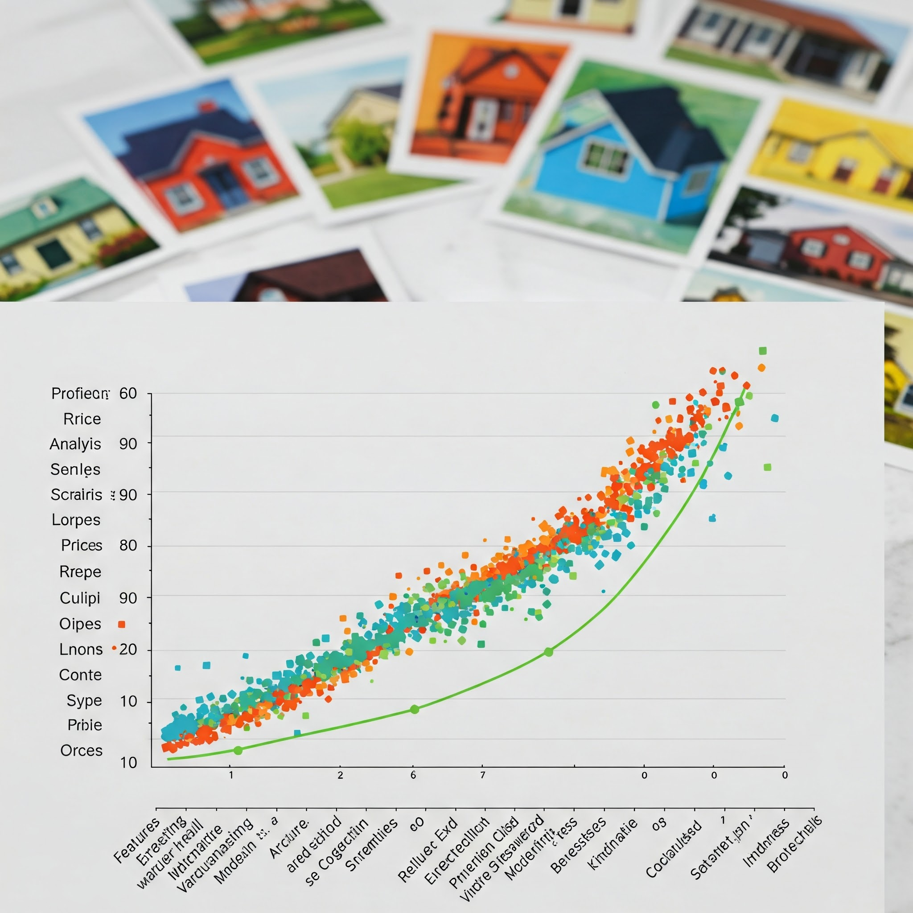

# Miles's Data Science Portfolio

This repository showcases my data science projects and analysis on various public datasets, demonstrating my expertise in data analysis, machine learning, and data visualization. The projects focus on real-world datasets from platforms like Kaggle and AICrowd, providing practical insights and solutions to complex data problems.

## 🎯 Project Overview

This portfolio contains:
- Data analysis notebooks for real-world datasets
- Reusable code components for common data science tasks

## 📂 Projects

| Project Title & Link | Description | Key Techniques & Focus |
| :--------------------------------------------------------------------------------------------------- | :--------------------------------------------------------------------------------------------------------------------------------------------------------------------------------------------------------------- | :----------------------------------------------------------------------------------------------------------------- |
| **[Bank Term Deposit Subscription Prediction](https://github.com/MilesQLi/Miles_Data_Science_Collection/tree/main/UCIBankMarketing)** | Analyzed marketing campaign data to predict if a client would subscribe to a term deposit. Developed a model to identify key influencing factors and built a web app for real-time predictions. | • EDA   • Feature Engineering   • Predictive Modeling (LGBM)   • Model Explainability (SHAP)   • Web App Deployment |
| **[Bank Churn Prediction](https://github.com/MilesQLi/Miles_Data_Science_Collection/tree/main/BinaryClassificationWithABankChurnDataset)** | Employed data science to determine the likelihood of a client churning from a bank. The project focuses on predicting churn and providing insights into its key drivers, enabling proactive retention strategies. | • EDA   • Data Cleaning   • Feature Engineering   • Modelling     • Explanation & Insights   • Proactive Retention |
| **[Melbourne Housing Price Prediction](https://github.com/MilesQLi/Miles_Data_Science_Collection/tree/main/MelbourneHousingPricePrediction)**    | Created meaningful features based on EDA. Predicted housing prices in Melbourne based on features like location, size, and age. Used SHAP values to understand feature influence and consolidate high-cardinality features.                    | • EDA   • Data Cleaning   • Feature Engineering   • Regression Modeling (LGBM)   • Model Explainability (SHAP)   • Feature Consolidation |
| **[Titanic Survival Prediction](https://github.com/MilesQLi/Miles_Data_Science_Collection/tree/main/TitanicSurvival)** | Analyzed passenger survival chances on the Titanic. Applied explanation techniques to the predictive model to identify major factors influencing survival outcomes. | • EDA   • Feature engineering   • Predictive Modeling   • Model Explainability (XAI)   • Feature Importance |
| **[KKBoxs Music Recommendation Challenge](https://github.com/MilesQLi/Miles_Data_Science_Collection/tree/main/KKBoxs%20Music%20Recommendation%20Challenge)** | Analyzed whether a music app user is likely to listen to a song again after the initial listening event. | • EDA   • Feature engineering   • Predictive Modeling   • Explanation   • Feature Importance |
| **[Reinforcement Learning Applications](https://github.com/MilesQLi/Miles_Data_Science_Collection/tree/main/Reinforcement_Learning)** | Analyzed whether a music app user is likely to listen to a song again after the initial listening event. | • RL Programming   • Wandb Logging |

## 🛠️ Utilities

The `utilities` folder contains reusable Python modules for data science tasks, including:
- Data preprocessing functions
- Data cleaning and transformation utilities
- Feature engineering tools
- Visualization utilities
- State-of-the-art machine learning model training strategies
- Machine learning model evaluation functions
- Result explanation and interpretation tools

## 📊 Skills Demonstrated

- Data Analysis and Visualization
- Machine Learning
- Python Programming
- Jupyter Notebooks
- Statistical Analysis
- Data Preprocessing
- Feature Engineering

## 📝 License

This project is open source and available under the Apache 2.0 License.

## Disclaimer

This software is provided "as is", without warranty of any kind, express or implied, including but not limited to the warranties of merchantability, fitness for a particular purpose and noninfringement. In no event shall the authors or copyright holders be liable for any claim, damages or other liability, whether in an action of contract, tort or otherwise, arising from, out of or in connection with the software or the use or other dealings in the software.

Users are responsible for checking and validating the correctness of their configuration files, safetensor files, and binary files generated using the software. The developers assume no responsibility for any errors, omissions, or other issues coming in these files, or any consequences resulting from the use of these files.

---
*This portfolio is actively maintained and updated with new projects and analyses.* 