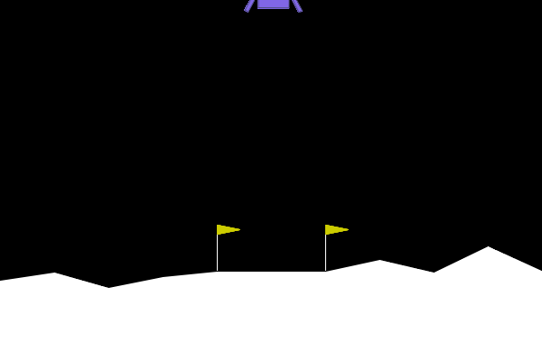

# Deep Q-Network (DQN) for LunarLander-v3

This project implements a Deep Q-Network (DQN) agent to solve the LunarLander-v3 environment from OpenAI's Gymnasium. The agent learns to control a lunar lander to safely land on a landing pad.



## Overview

The implementation uses:
- PyTorch for the neural network implementation
- Experience Replay Buffer for better sample efficiency
- Target Network for stable learning
- Epsilon-greedy exploration strategy
- Weights & Biases (wandb) for experiment tracking

## Key Components

1. **DQN Network Architecture**:
   - Input layer: State size (8 dimensions)
   - Hidden layers: Two fully connected layers with 64 neurons each
   - Output layer: Action size (4 dimensions)
   - Activation: ReLU between layers

2. **Replay Buffer**:
   - Capacity: 10,000 transitions
   - Random sampling for batch training

3. **Training Parameters**:
   - Learning rate: 0.001
   - Discount factor (gamma): 0.99
   - Epsilon decay: 0.995
   - Batch size: 64
   - Target network update: Soft update with tau=0.005

## Training Process

The agent is trained for 3000 episodes with the following features:
- Maximum 1000 steps per episode
- Video recording every 100 episodes
- Rolling average reward tracking
- Epsilon-greedy exploration strategy
- Experience replay for stable learning

## Results

The agent learns to:
- Navigate the lunar lander to the landing pad
- Control the lander's orientation
- Manage fuel consumption
- Achieve smooth landings

## Requirements

- Python 3.x
- PyTorch
- Gymnasium
- NumPy
- Weights & Biases (wandb)
- ImageIO (for video recording)

## Usage
1. Run the training:
```bash
python DQN_LunarLander.py
```

3. Monitor training progress on Weights & Biases dashboard

## Implementation Details

The code includes:
- DQN network implementation
- Experience replay buffer
- Training loop with epsilon-greedy exploration
- Target network updates
- Video recording functionality
- Weights & Biases integration for experiment tracking
