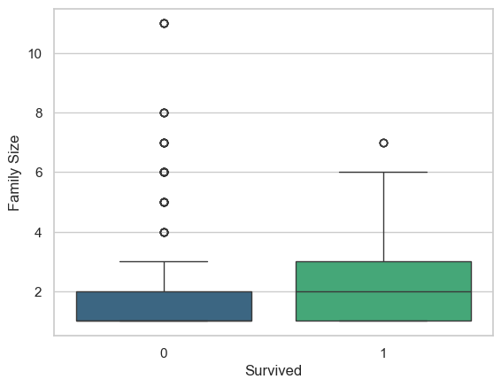
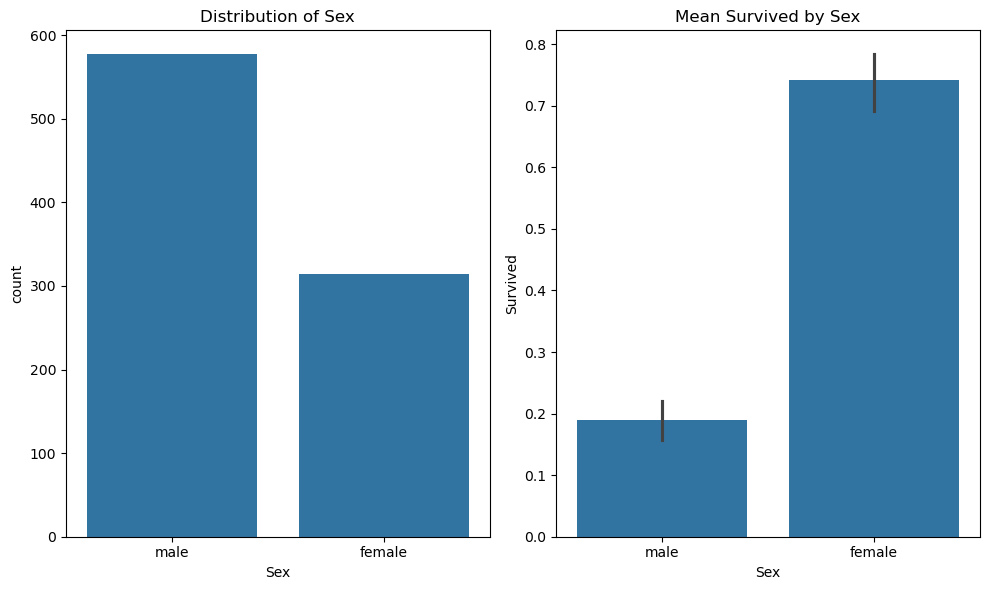
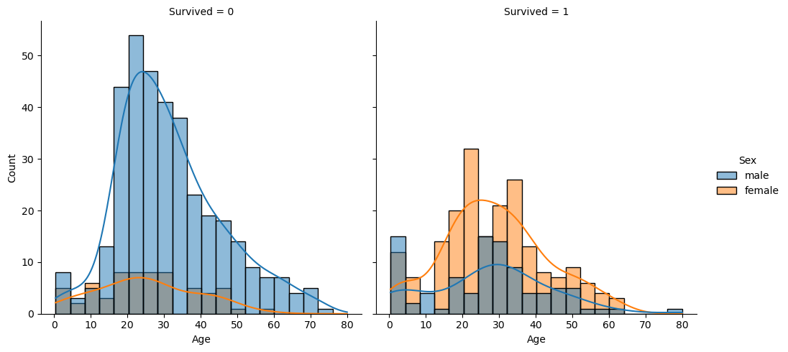
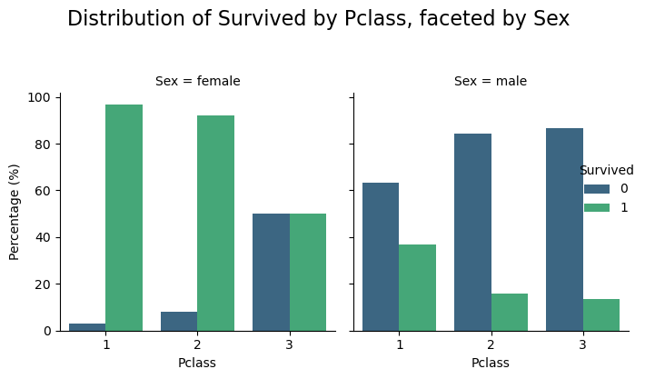
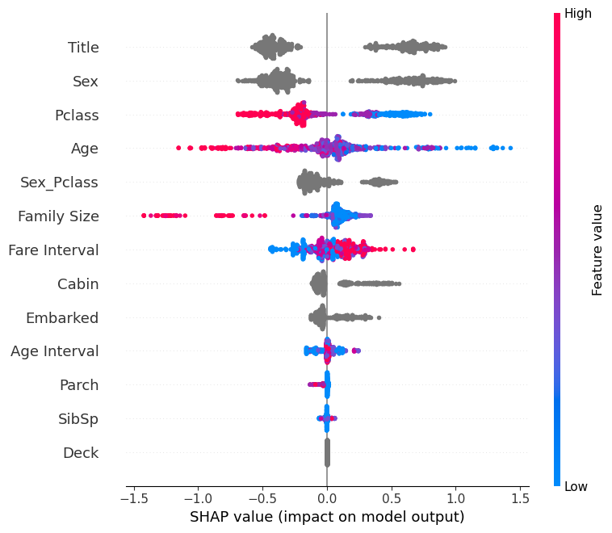
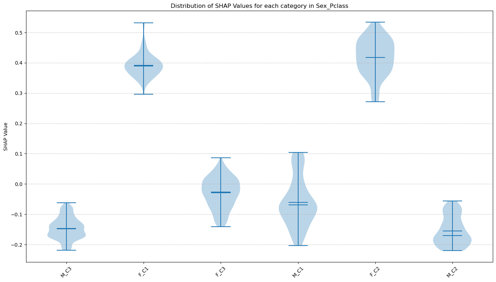
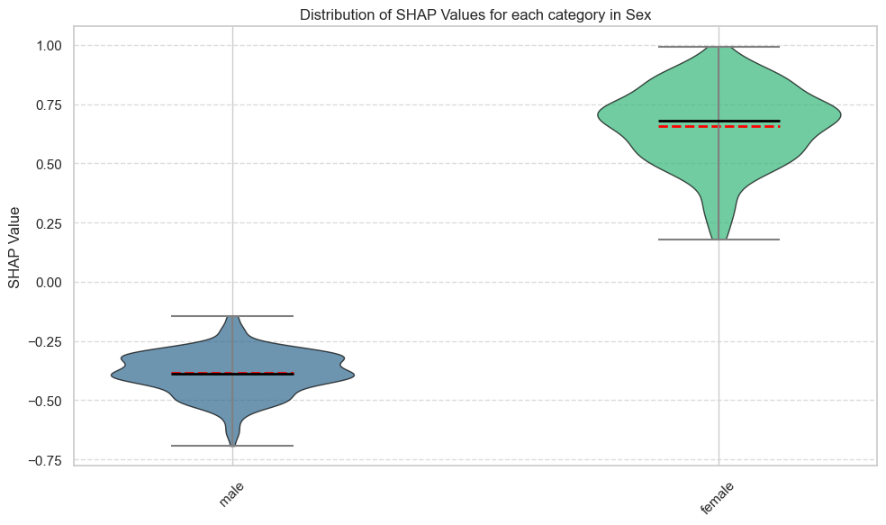

**Executive Summary: Titanic Survival Prediction Project**

**1. Project Goal**
The primary objective of this project was to develop predictive models to determine the likelihood of survival for passengers aboard the Titanic. A secondary, but equally important, goal was to understand the key factors influencing survival, providing interpretable insights from the models.

**2. Data Overview**
The project utilized the classic Titanic dataset, comprising `train.csv` (for model training and analysis) and `tested.csv` (for testing, although survival outcomes were present, allowing for evaluation). The dataset contains passenger information such as class, sex, age, fare, cabin, and port of embarkation.

**3. Methodology**

The project followed a standard data science workflow:
    *   **Exploratory Data Analysis (EDA):** Initial data inspection revealed data types, missing values (notably in 'Age', 'Cabin', and 'Embarked'), and distributions. Bivariate analysis was performed to understand relationships between numerical/categorical features and the 'Survived' target. We can identify obvious correlation between 'Sex' and 'Survived', as well as 'Family Size' and 'Survived'.

    Trivariate analysis also shows correlations between two features and "Survived". Such as ("Sex", "Age", "Survived") and ("Sex", "PClass", "Survived").

  
    *   **Feature Engineering:** Several new features were created to enhance predictive power:
        *   `Family Size`: Sum of 'SibSp' (siblings/spouses) and 'Parch' (parents/children) plus 1.
        *   `Age Interval` & `Fare Interval`: Binned versions of 'Age' and 'Fare'.
        *   `Sex_Pclass`: An interaction term combining 'Sex' and 'Pclass'.
        *   `Deck`: Extracted from the first letter of the 'Cabin' feature.
        *   `Family Name`, `Title`, `Given Name`, `Maiden Name`: Parsed from the 'Name' feature. A word cloud of 'Family Name' was also generated.
    *   **Data Preprocessing:** Missing values in 'Age' were imputed with the median, while 'Cabin' and 'Maiden Name' missing values were filled with "Unknown". Categorical features were appropriately encoded for model consumption (category type for LightGBM, one-hot encoding for the IFFNN).
    *   **Modeling & Evaluation:**
        *   **LightGBM:** A LightGBM classifier was trained and evaluated, with hyperparameter tuning likely performed implicitly by the `training_binary_classification_with_lgbm` function. SHAP (SHapley Additive exPlanations) was used for model interpretability.
        *   **IFFNN (Interpretable FeedForward Neural Network):** A custom IFFNN model with an architecture of [Input -> 226 -> 113 -> 113 -> 113 -> 226 -> Output] was trained. The model features built-in explainability.
    *   **Explanation:** Both models were leveraged to understand feature influences on survival predictions.

**4. Key Findings & Feature Influence on Survival**

*   **Model Performance:**
    *   The **LightGBM** model achieved a strong test **AUROC of approximately 0.888**.
    *   The **IFFNN** model achieved a test **accuracy of 83.01%**.

*   **Feature Influence (Insights from IFFNN and general LightGBM/Titanic knowledge):**
    The IFFNN's `explain` method provided direct feature contributions for individual predictions, and combined with general knowledge from Titanic SHAP analyses, the following influences were observed:

    *   **Positive Influence on Survival (Higher Chance):**
        *   **`Title` ("Miss.", "Mrs."):** Female titles consistently showed a strong positive contribution to survival probability.
        *   **`Sex & Class` (Female):** Being female and locating in a high class cabin significantly increased survival chances. This is also reflected in combined features like `Sex_Pclass_F_C2`.
        *   **`Fare` / `Fare Interval` (Higher values):** Passengers who paid higher fares (often indicative of higher class or better cabin location) had a greater chance of survival. For example, a `Fare Interval` of 3.0 showed a strong positive contribution.
        *   **`Deck` (Specific Decks like 'C', 'E'):** Being on certain decks (e.g., 'C' from Cabin 'C85', or 'E' from 'E121') positively influenced survival, likely due to proximity to lifeboats or higher passenger class.
        *   **`Age Interval` (Younger):** Children generally had a higher survival chance, although this could be nuanced. For instance, an `Age Interval` of 3.0 (older adults) also showed a positive influence in one IFFNN sample, possibly due to interaction with other high-survival-probability features like high fare.

    *   **Negative Influence on Survival (Lower Chance):**
        *   **`Sex` (Male):** Being male strongly decreased survival chances. This is prominent in features like `Sex_male` and `Sex_Pclass_M_C3`.
        *   **`Pclass` (3rd Class):** Passengers in the 3rd class had a significantly lower chance of survival. This was evident in `Pclass` itself and in interaction terms like `Sex_Pclass_M_C3`. Even Pclass 1 or 2 could show negative *relative* contribution in the IFFNN if other features in a sample were overwhelmingly positive (e.g., very high fare might make Pclass 1's positive impact seem less significant than the fare itself).
        *   **`Cabin_Unknown` / `Deck_Unknown`:** Missing cabin information, often correlated with lower-class passengers, negatively impacted survival predictions.
        *   **`Age` (Certain Adult Ranges):** While nuanced, adult males, particularly in lower classes, had a lower survival rate. An age of 50 showed a negative contribution in one IFFNN sample.
        *   **`SibSp` (Higher values):** Having a larger number of siblings/spouses (e.g., `SibSp`=2 in one IFFNN sample) could negatively influence survival, possibly due to difficulties in coordinating escape for larger family units without priority.
        *   `Family Size` (larger, for lower class males): While not explicitly in the IFFNN samples shown, larger family sizes for lower-class males often correlate with lower survival.

**5. Conclusion**
Both the LightGBM and IFFNN models demonstrated good predictive performance on the Titanic survival task. The feature engineering steps, particularly the creation of `Title`, `Family Size`, `Deck`, and interaction terms like `Sex_Pclass`, proved valuable. The explanations derived indicate that socio-economic status (reflected by `Pclass`, `Fare`, `Cabin`/`Deck`) and demographics (`Sex`, `Age`, `Title`) were paramount in determining survival chances, aligning with historical understanding of the disaster. Female passengers, those in higher classes/paying higher fares, and children generally had a better prognosis.