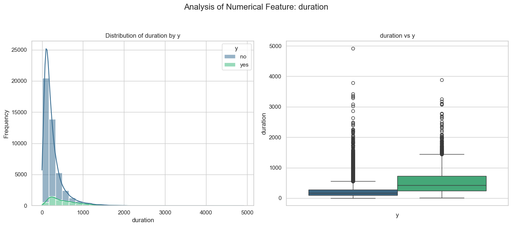
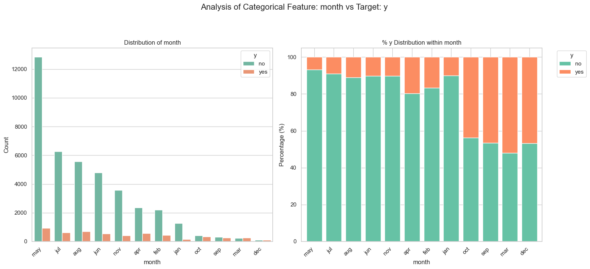
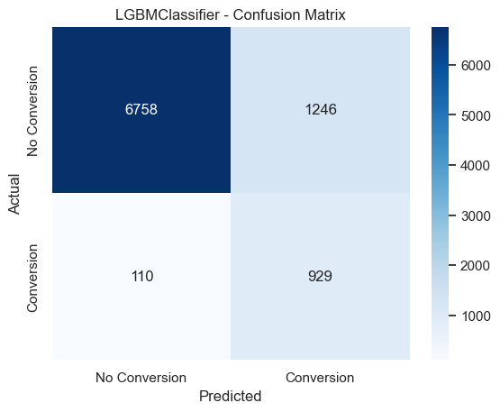
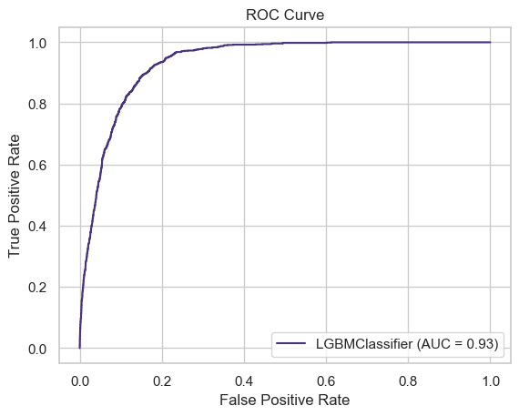
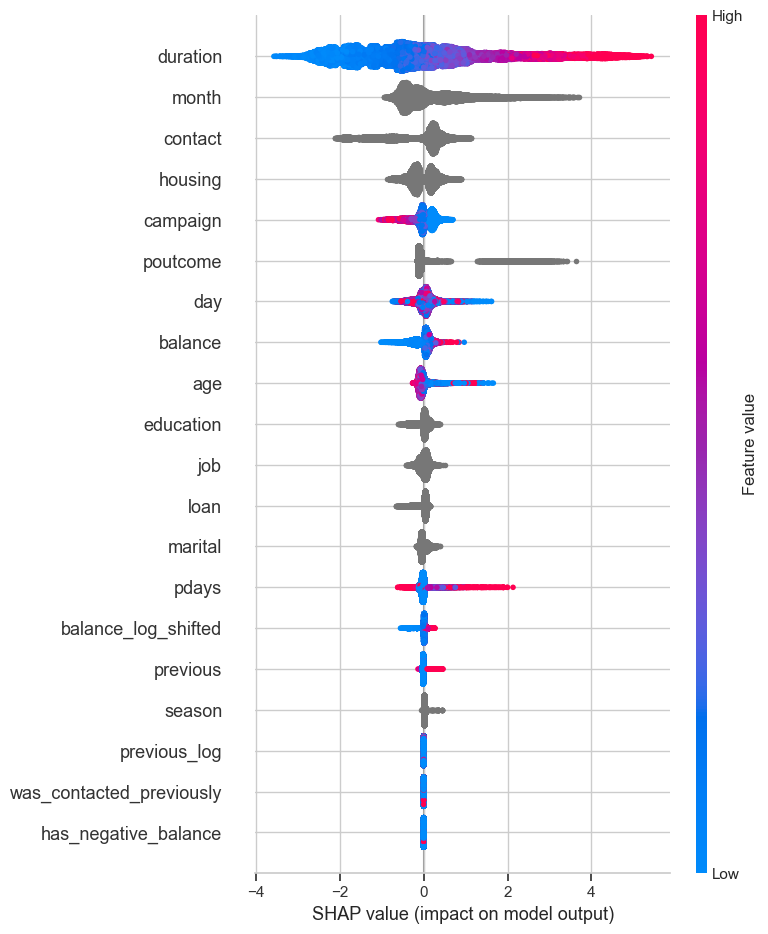
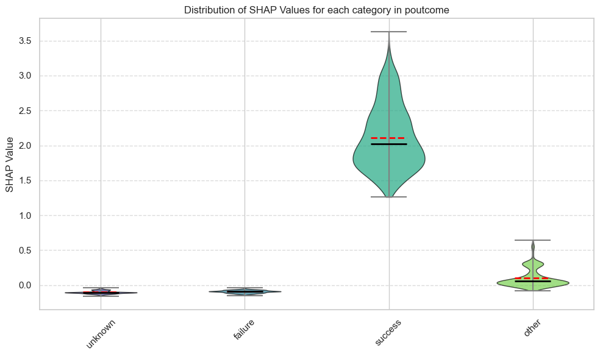
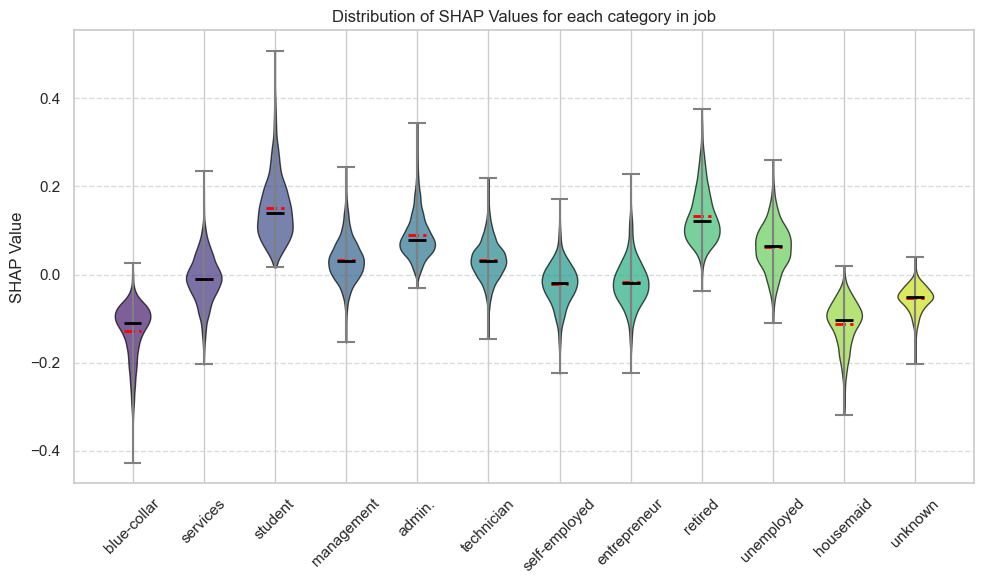
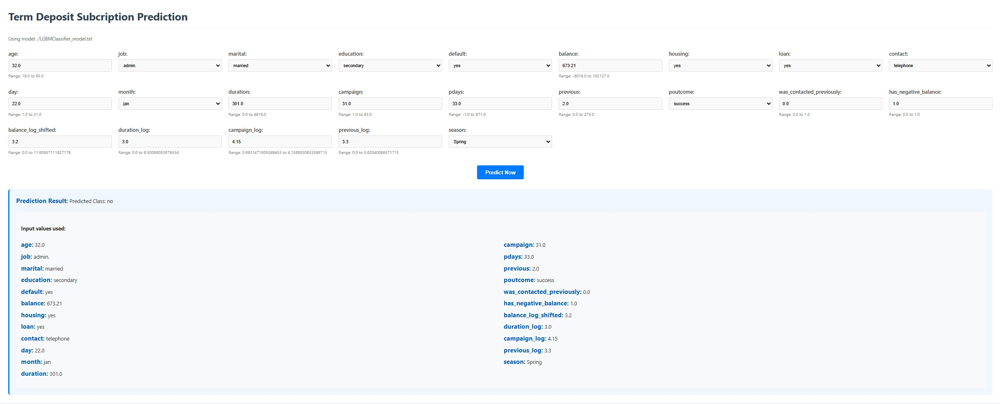

# Executive Summary: Bank Term Deposit Subscription Prediction

## 1. Introduction & Objective

This project aimed to analyze a dataset of direct marketing campaigns (phone calls) by a Portuguese banking institution to predict whether a client would subscribe to a term deposit (`y` variable). The primary objective was to identify key factors influencing a client's decision and to develop a predictive model that can assist the bank in optimizing future marketing campaigns. A secondary outcome was the development of an interactive web application for real-time predictions on new client profiles.

## 2. Data Overview

The dataset (`bank-full.csv`) contains 45,211 client records with 17 attributes, including client demographics, socio-economic factors, and past campaign interaction details. There were no missing values or duplicated rows in the dataset, ensuring data quality for analysis and modeling. The target variable 'y' indicates subscription (yes/no).

## 3. Exploratory Data Analysis (EDA) & Feature Engineering

### 3.1. Key EDA Insights:

Initial EDA revealed several patterns:

*   **Call Duration (`duration`):** This was a highly influential numerical feature. Longer call durations were strongly associated with a higher likelihood of subscription.
    *   
*   **Previous Campaign Outcome (`poutcome`):** Clients who had a 'success' outcome in a previous campaign were significantly more likely to subscribe again.
    *   
*   **Month of Contact (`month`):** Certain months (e.g., March, September, October, December) showed higher subscription rates, possibly due to fewer overall campaigns or specific economic conditions. May had a particularly low success rate.
    *   
*   **Housing/Personal Loans (`housing`, `loan`):** Clients without existing housing or personal loans were more likely to subscribe.
*   **Contact Method (`contact`):** Cellular and telephone contact methods yielded better results than 'unknown'.

### 3.2. Feature Engineering:

To enhance model performance, several new features were created:

*   `was_contacted_previously`: A binary flag derived from `pdays` (where -1 indicates no previous contact).
*   `has_negative_balance`: A binary flag for clients with a negative account balance.
*   Log Transformations: `balance_log_shifted`, `duration_log`, `campaign_log`, `previous_log` were created to handle skewness in these numerical features.
*   `season`: Derived from the `month` feature to capture seasonal trends.

## 4. Model Development & Evaluation

A LightGBM (Light Gradient Boosting Machine) classifier was selected for its efficiency and performance with tabular data.

*   **Data Preparation:** Categorical features were appropriately encoded, and the data was split into training and testing sets (80/20).
*   **Training:** The model was trained on the training set, with hyperparameter tuning guided by AUC on a validation split. The best model achieved a validation AUROC of 0.9415.
*   **Performance on Test Set:**
    *   **Accuracy:** 85.00%
    *   **AUC-ROC:** 0.9346
    *   **Precision (for 'yes'):** 0.43
    *   **Recall (for 'yes'):** 0.89
    *   **F1-Score (for 'yes'):** 0.58

The model demonstrates strong discriminative power (AUC 0.9346). It excels at identifying clients who will subscribe (Recall 0.89), meaning it correctly flags 89% of actual subscribers. However, its precision of 0.43 indicates that when it predicts a subscription, it is correct 43% of the time, suggesting a notable number of false positives.

## 5. Key Drivers of Subscription (SHAP Analysis)

SHAP (SHapley Additive exPlanations) values were used to understand feature importance and their impact on model predictions.

*   **`duration` (Call Duration):** The most influential feature. Longer call durations significantly increase the likelihood of subscription.
*   **`month` (Month of Contact):** Certain months (e.g., March, October, September, December - typically shown as red dots pushing SHAP values positive) positively influence subscription, while others (e.g., May - blue dots pushing SHAP values negative) decrease it.
*   **`contact` (Contact Communication Type):** 'Cellular' and 'telephone' contacts generally increase the likelihood of subscription compared to 'unknown'.
*   **`housing` (Housing Loan):** Having no housing loan (value 'no', often red dots) increases the likelihood of subscription.
*   **`campaign` (Number of Contacts in Campaign):** Fewer contacts during the current campaign (lower values, often blue dots) are associated with a higher likelihood of subscription.
*   **`poutcome` (Previous Campaign Outcome):** A 'success' in a previous campaign strongly increases the likelihood of a new subscription. An 'unknown' outcome (most common) has a less positive impact than 'success', while 'failure' has a negative impact.
    
*   **`balance` (Account Balance):** Higher balances tend to slightly increase the subscription likelihood, though the impact is less pronounced than `duration`.
*   **`age`:** Older clients tend to have a slightly higher propensity to subscribe.
*   **`job`:** 'Student' and 'retired' job types show a higher tendency to subscribe.
    

## 6. Web Application for Prediction

To operationalize the model, a web application was developed. This tool allows bank staff to input client characteristics and receive an instant prediction on whether the client is likely to subscribe to a term deposit. This can help in prioritizing leads and tailoring marketing efforts.

## 7. Conclusion & Recommendations

The project successfully developed a robust LightGBM model (AUC 0.9346) capable of predicting term deposit subscriptions. Key drivers identified include call duration, month of contact, previous campaign success, and housing loan status.

**Recommendations:**

*   **Prioritize Leads:** Use the model (and the web app) to score and prioritize clients for marketing calls.
*   **Optimize Call Strategy:** While call duration is post-call information, its strong correlation suggests that engaging conversations are key. Focus training on maintaining client engagement.
*   **Targeted Campaigns:** Consider focusing campaigns during historically successful months and on client segments identified as more receptive (e.g., no existing loans, students, retired individuals).
*   **Monitor False Positives:** Given the model's recall-precision trade-off, be aware that while it captures most potential subscribers, it will also flag some non-subscribers. This is acceptable if the cost of a missed opportunity is higher than the cost of contacting a non-subscribing client.
*   **Iterative Improvement:** Continuously monitor model performance and retrain with new data to maintain accuracy and adapt to changing market dynamics.

This predictive model and the associated web application provide valuable tools for the bank to enhance the efficiency and effectiveness of its term deposit marketing campaigns.